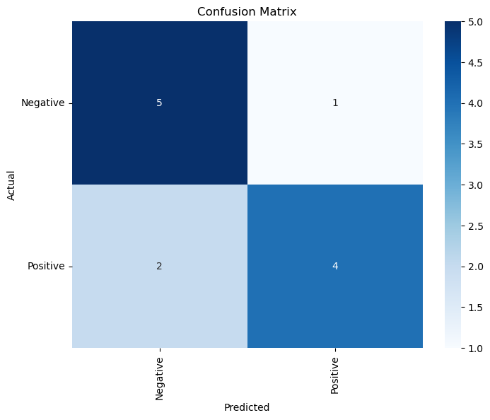
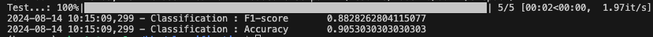
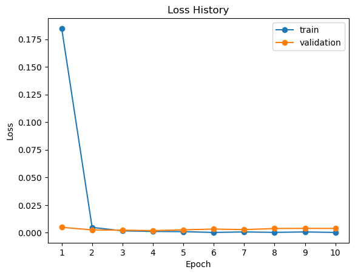
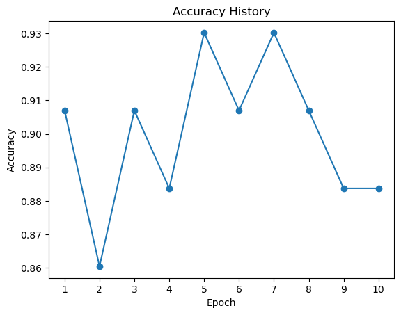

# Universal Classification Code

Hugginface의 모델들을 이용하여 classification task를 수행할 수 있는 Code

## Abstract

모델을 제외한 Trainer, Utils 등을 직접 수정 및 관리 하여 학습을 수행할 수 있는 저장소 입니다.

## Dataset

data/ 폴더 아래에 train, valid, test 등을 나누어 학습을 수행할 수 있습니다.  
만약, 하나의 데이터셋으로 validation을 나누어 사용하고 싶다면 아래의 코드를 `utils/train_utils.py`의 `get_dataset`에 추가하여 이용할 수 있습니다.

```python
from torch.utils.data import DataLoader, random_split

def get_dataset(config, modes):

    tokenizer = AutoTokenizer.from_pretrained(config.tokenizer_path, cache_dir=config.cache_dir, trust_remote_code=True)
    dataset = CustomDataset(config, tokenizer)
    if len(modes) > 1:
        train_size = int(len(dataset) * 0.9)
        valid_size = len(dataset) - train_size
        dataset = random_split(dataset, [train_size, valid_size])

    return {mode:ds for mode, ds in zip(modes, dataset)}, tokenizer
```

`data/label2id.json`이 있다는 가정하에 dataset이 동작합니다.


## Tree

```
.
├── config
│   └── config.yaml             # config file
│
├── models
│   ├── __init__.py
│   └── modeling.py             # modeling file
│
├── results                     # folder for save model
│
│
├── trainer
│   ├── __init__.py
│   ├── base.py                 # base trainer file
│   └── trainer.py              # gpt2 trainer
│
├── utils
│   ├── __init__.py
│   ├── data_utils.py           # dataset file
│   ├── file_utils.py           # file for file system
│   └── train_utils.py          # file for training
│
├── requirements.txt
│
└── main.py                     # file for running
```

## QuickStart

### Train
```
python main.py --config config/config.yaml
```

### Test
```
python main.py --mode test --checkpoint <checkpoint folder>
```

#### Test Result Samples

- **confusion matrix**



<br>

- **F1-score & Accuracy**



## Training Result Samples

### Loss History (RoBERTa)



### Accuracy History (RoBERTa)

